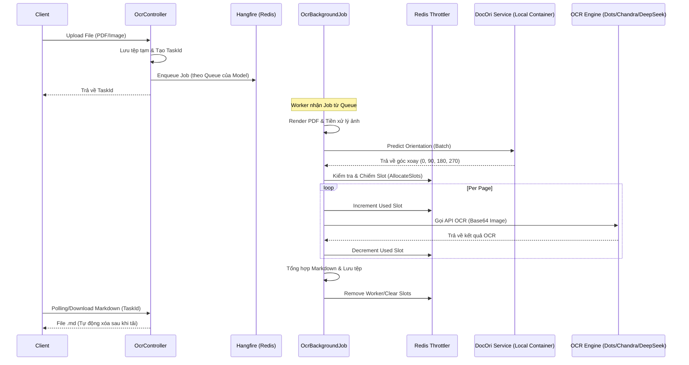

# OCREngine 🚀

OCREngine là một dịch vụ Microservice mạnh mẽ xây dựng trên .NET 9, chuyên xử lý chuyển đổi tài liệu (PDF, Hình ảnh) sang định dạng Markdown chất lượng cao. Hệ thống được thiết kế để xử lý tải lớn bất đồng bộ, hỗ trợ nhiều mô hình AI OCR khác nhau và tích hợp cơ chế điều phối tài nguyên thông minh.

## 🏗️ Kiến Trúc Hệ Thống (Architecture)

Dự án tuân thủ mô hình xử lý bất đồng bộ (Asynchronous Processing) với các thành phần chính:

1.  **API Layer (Controllers)**: Tiếp nhận yêu cầu, lưu trữ tệp tạm thời và đẩy công việc vào hàng đợi.
2.  **Background Processing (Hangfire)**: Quản lý hàng đợi công việc, hỗ trợ retry và phân tách hàng đợi theo từng loại Model.
3.  **Concurrency Management (Redis)**: Sử dụng Redis để giới hạn số lượng request đồng thời tới các API OCR của bên thứ ba, tránh bị rate limit hoặc quá tải chi phí.
4.  **OCR Pipeline**: Quy trình xử lý ảnh chuẩn hóa (Render PDF -> Resize -> Định hướng lại -> OCR).

### 🔄 Luồng Xử Lý (Workflow)



## ✨ Tính Năng Nổi Bật

-   **Hỗ trợ đa mô hình (Multi-model)**: Tích hợp linh hoạt với `Dots`, `Chandra`, và `DeepSeek OCR`.
-   **Xử lý PDF thông minh**: Tự động render PDF sang ảnh chất lượng cao (300 DPI) trước khi OCR.
-   **Tự động định hướng (Auto-Orientation)**: Tích hợp `DocOriService` để nhận diện và xoay ảnh về đúng chiều trước khi gửi tới AI.
-   **Real-time Event Streaming**: Đẩy trạng thái xử lý từng trang qua Redis Stream để client theo dõi tiến độ.
-   **Resource Throttling**: Tự động điều tiết số lượng trang xử lý song song dựa trên cấu hình `Concurrency` của từng Model trong `appsettings.json`.

## 🛠️ Công Nghệ Sử Dụng

-   **Core**: .NET 9 (Web API)
-   **Background Jobs**: Hangfire với Redis Storage.
-   **Image Processing**: SkiaSharp, SixLabors.ImageSharp, PDFtoImage.
-   **OCR API**: Azure AI Inference SDK (tương thích OpenAI format).
-   **Logging**: Serilog (Console & File JSON).
-   **Documentation**: Scalar (OpenAPI 3.1).

## 📂 Cấu Trúc Thư Mục

-   `Applications/`: Chứa các Logic nghiệp vụ chính, Interfaces và Background Jobs.
-   `Controllers/`: Các API Endpoints (`process`, `cancel`, `get-markdown`).
-   `Infrastructure/`: Triển khai các dịch vụ ngoại vi (Redis, OCR Engines, Lua Scripts cho Redis).
-   `Models/`: Các Data Models, Enums và DTOs.
-   `Helpers/` & `Utils/`: Các thư viện tiện ích xử lý ảnh, file và LLM.

## 🚀 Hướng Dẫn Chạy Dự Án

### Chạy bằng Docker (Khuyên dùng)

Dự án đã được tối ưu hóa với **Alpine Linux** để đạt kích thước cực nhẹ (~100MB runtime).

1.  Cấu hình Redis trong `docker-compose.yml` hoặc truyền biến môi trường.
2.  Chạy lệnh:
    ```powershell
    docker-compose up -d --build
    ```
3.  Truy cập Swagger/Scalar tại: `http://localhost:5258/docs`

### Chạy Local (Development)

1.  Yêu cầu: .NET 9 SDK, Redis server đang chạy.
2.  Cấu hình `appsettings.json` (ApiKey, BaseUrl cho các OCR provider).
3.  Chạy tệp `OCREngine.sln` hoặc dùng CLI:
    ```powershell
    dotnet run --project OCREngine.csproj
    ```

## ⚙️ Cấu Hình (Configuration)

Các tham số chính trong `appsettings.json`:
-   `Hangfire`: Cấu hình kết nối Redis và số lượng Worker.
-   `LlmModels`: Cấu hình ApiKey, BaseUrl và `Concurrency` (giới hạn song song) cho từng loại model.
-   `ExternalServices`: Cấu hình cho dịch vụ định hướng ảnh (`DocOri`).

---
*Phát triển bởi đội ngũ Kỹ thuật OCREngine.*
