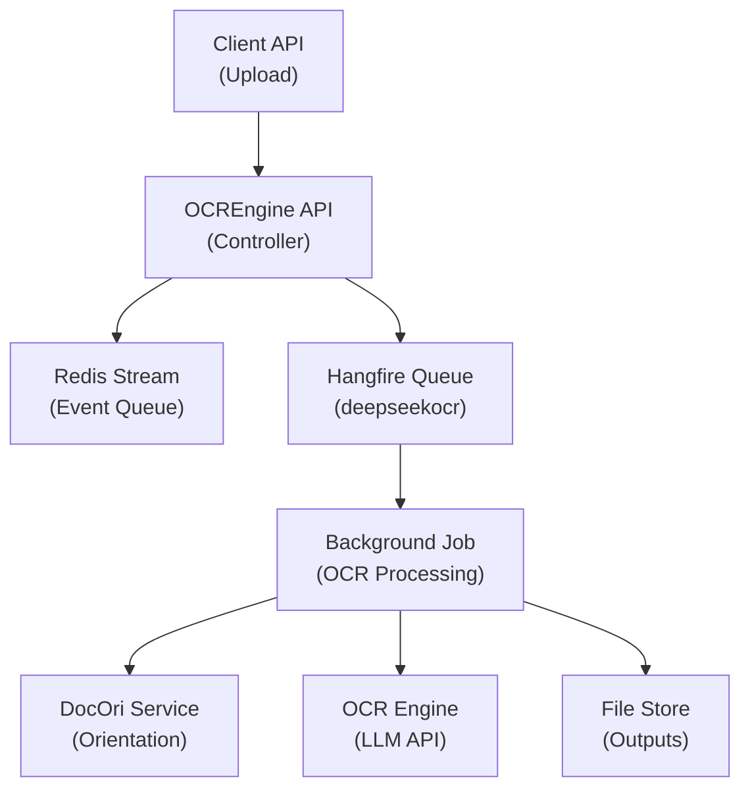
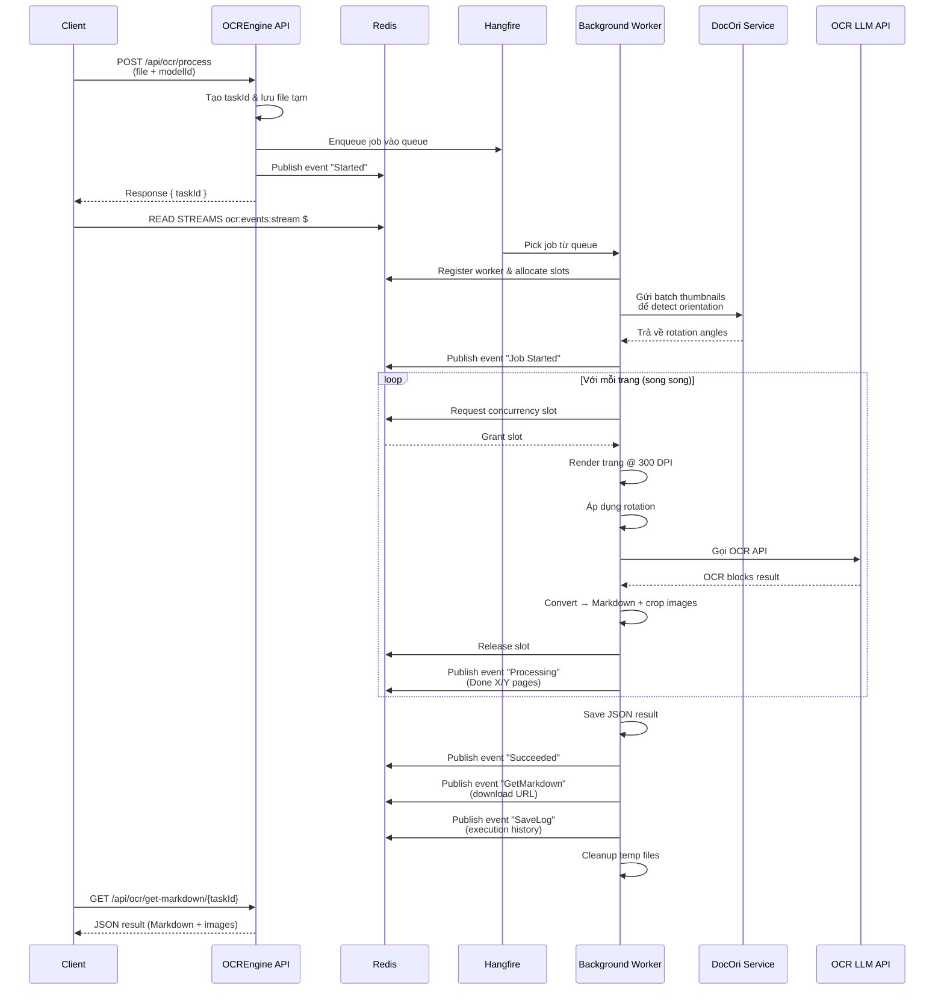

# OCREngine Service Integration Documentation

Tài liệu tích hợp OCREngine - Microservice OCR bất đồng bộ với real-time event streaming qua Redis.

---

## Mục Lục

1. [Tổng quan](#1-tổng-quan)
2. [Kiến trúc hệ thống](#2-kiến-trúc-hệ-thống)
3. [API Endpoints](#3-api-endpoints)
4. [Event Stream chi tiết](#4-event-stream-chi-tiết)
5. [Luồng xử lý Background OCR](#5-luồng-xử-lý-background-ocr)
6. [Định dạng dữ liệu](#6-định-dạng-dữ-liệu)
7. [Ví dụ tích hợp](#7-ví-dụ-tích-hợp)
8. [Xử lý lỗi & Cancel](#8-xử-lý-lỗi--cancel)

---

## 1. Tổng quan

**OCREngine** là microservice OCR chuyên biệt, xử lý tài liệu (PDF, hình ảnh) và chuyển đổi sang định dạng Markdown chất lượng cao. Service sử dụng mô hình **asynchronous processing** với các đặc điểm:

- **Background Jobs**: Xử lý qua Hangfire với hàng đợi riêng cho từng model OCR
- **Real-time Events**: Phát sự kiện qua Redis Stream để client theo dõi tiến độ
- **Multi-model Support**: Hỗ trợ nhiều mô hình OCR (DeepSeekOCR, ChandraOCR)
- **Concurrency Control**: Điều phối tài nguyên thông minh qua Redis Lua scripts
- **Auto-orientation**: Tự động phát hiện và xoay trang bị nghiêng trước khi OCR

---

## 2. Kiến trúc hệ thống

### 2.1 Tổng quan kiến trúc



### 2.2 Luồng dữ liệu chi tiết



### 2.3 Phân tầng hệ thống

```mermaid
flowchart LR
    subgraph ClientLayer["Client Layer"]
        WebApp["Web Application"]
        MobileApp["Mobile App"]
        ThirdParty["Third-party Services"]
    end

    subgraph APILayer["API Gateway Layer"]
        OcrController["OcrController<br/>(REST API)"]
        Auth["Authentication"]
        Validation["Request Validation"]
    end

    subgraph ProcessingLayer["Processing Layer"]
        Hangfire["Hangfire<br/>(Job Queue)"]
        BackgroundJob["OcrBackgroundJob"]
        Concurrency["Redis Concurrency<br/>(Lua Scripts)"]
    end

    subgraph ServicesLayer["Services Layer"]
        DocOri["DocOri Service<br/>(Orientation)"]
        ChandraOCR["Chandra OCR Engine"]
        DeepSeekOCR["DeepSeek OCR Engine"]
    end

    subgraph StorageLayer["Storage Layer"]
        Redis["Redis<br/>(Streams + Hashes)"]
        FileSystem["File System<br/>(tmp_upload, Outputs)"]
    end

    ClientLayer --> APILayer
    APILayer --> ProcessingLayer
    ProcessingLayer --> ServicesLayer
    ProcessingLayer --> StorageLayer
    ServicesLayer --> StorageLayer
```



### 2.4 Thành phần chính

| Component | Mô tả |
|-----------|-------|
| **API Layer** | Tiếp nhận upload, validate, tạo taskId và enqueue job |
| **Hangfire** | Quản lý hàng đợi background jobs với retry policy |
| **Redis Stream** | Phát events real-time cho client subscribe |
| **OCR Engines** | Keyed services cho từng model OCR |
| **DocOri Service** | Service ngoài phát hiện hướng trang (orientation) |
| **Concurrency Control** | Redis Lua scripts điều phối slots giữa workers |

---

## 3. API Endpoints

### 3.1 Submit OCR Task

**Endpoint:** `POST /api/ocr/process`

Tiếp nhận file PDF/Image và bắt đầu xử lý OCR bất đồng bộ.

#### Request

- **Content-Type:** `multipart/form-data`

| Parameter | Type | Required | Description |
|-----------|------|----------|-------------|
| `File` | `IFormFile` | ✅ | File PDF hoặc hình ảnh (JPG, PNG, WEBP, BMP) |
| `ModelId` | `string` | ✅ | Model OCR sử dụng. Giá trị hợp lệ: `deepseekocr` |

#### Response

**Success (200 OK):**
```json
{
  "taskId": "serverabc-550e8400-e29b-41d4-a716-446655440000",
  "message": "File uploaded and processing started."
}
```

| Field | Type | Description |
|-------|------|-------------|
| `taskId` | `string` | Định danh duy nhất cho task. Dùng để query progress và download kết quả |
| `message` | `string` | Thông báo trạng thái |

**Error Responses:**

| Status | Code | Description |
|--------|------|-------------|
| `Bad Request` | 400 | File rỗng hoặc `ModelId` không hợp lệ |
| `Conflict` | 409 | File cùng tên đang được xử lý |
| `Internal Server Error` | 500 | Lỗi server khi lưu file |

#### cURL Example

```bash
curl -X POST http://localhost:5258/api/ocr/process \
  -H "Authorization: Bearer <token>" \
  -F "File=@document.pdf" \
  -F "ModelId=dots"
```

---

### 3.2 Get Markdown Result

**Endpoint:** `GET /api/ocr/get-markdown/{taskId}`

Tải kết quả OCR dưới dạng JSON chứa Markdown và hình ảnh đã crop.

#### Request

| Parameter | Type | Required | Description |
|-----------|------|----------|-------------|
| `taskId` | `string` | ✅ | Task ID nhận từ response của `/process` |

#### Response

**Success (200 OK):**
- **Content-Type:** `application/json`
- **File:** `{originalFileName}_{taskId}.json`

**Response Schema:**
```json
[
  {
    "pageIndex": 41,
    "markdown": "<table>......</table>",
    "images": {
      "imgs/img_in_image_box_300_300_1010_1000.jpg": "/9j/4AAQSkZJRgABAQAAAQA..."
    }
  },
  {
    "pageIndex": 19,
    "markdown": "",
    "images": {
      "299_420_1606_3135.jpg": "/9j/4AAQSkZJRgABAQAAAQABAAD/4gHY..."
    }
  }
]
```

| Field | Type | Description |
|-------|------|-------------|
| `pageIndex` | `int` | Chỉ số trang (0-based) |
| `markdown` | `string` | Nội dung Markdown của trang, chứa các thẻ ảnh dạng `` |
| `images` | `object` | Dictionary chứa dữ liệu hình ảnh (Base64).<br>- **Key:** Tên file/đường dẫn ảnh (trùng khớp với `image_key` trong Markdown)<br>- **Value:** Nội dung ảnh ở định dạng Base64 |

#### 🖼️ Cơ chế ánh xạ hình ảnh (Image Mapping)

Hệ thống tự động phát hiện các vùng chứa bảng, biểu đồ hoặc hình ảnh và thực hiện crop. Để hiển thị đúng kết quả, bạn cần thực hiện ánh xạ như sau:

1. **Trong Markdown:** Các hình ảnh được nhúng bằng cú pháp chuẩn ``.
2. **Trong Images:** Dictionary chứa key tương ứng với đường dẫn trong `()`.
3. **Xử lý phía Client:** Khi render Markdown, client nên duyệt qua dictionary `images`, lấy dữ liệu Base64 tương ứng với key để gán vào `src` của thẻ `` (hoặc chuyển đổi sang Blob URL).

**⚠️ Lưu ý quan trọng:**
- File JSON được **tự động xóa** khỏi server ngay sau khi response hoàn tất
- Client cần lưu trữ kết quả ngay khi nhận được
- Nếu gọi lại endpoint sau khi file đã xóa → `404 Not Found`

**Error Responses:**

| Status | Code | Description |
|--------|------|-------------|
| `Not Found` | 404 | Task chưa hoàn thành hoặc file đã bị xóa |

---

### 3.3 Cancel Task

**Endpoint:** `POST /api/ocr/cancel?taskId={taskId}`

Gửi tín hiệu hủy task đang xử lý.

#### Request

| Parameter | Type | Required | Description |
|-----------|------|----------|-------------|
| `taskId` | `string` | ✅ | Task ID cần hủy |

#### Response

**Success (200 OK):**

Trường hợp 1: Job đang chạy hoặc trong queue
```json
{
  "message": "Cancellation signal sent for Task serverabc-550e8400-e29b-41d4-a716-446655440000",
  "status": "Running-Canceling",
  "removedFromRedis": true,
  "deletedFromQueue": false
}
```

| Field | Type | Description |
|-------|------|-------------|
| `message` | `string` | Thông báo trạng thái hủy |
| `status` | `string` | Trạng thái task:<br>- `"Running-Canceling"`: Job đang chạy, đã gửi signal cancel qua Redis<br>- `"Queued-Canceled"`: Job còn trong queue, đã xóa khỏi Hangfire<br>- `"Completed"`: Task đã hoàn thành trước khi cancel |
| `removedFromRedis` | `bool` | true nếu đã xóa worker khỏi Redis (job đang chạy) |
| `deletedFromQueue` | `bool` | true nếu đã xóa job khỏi Hangfire queue |

Trường hợp 2: Job đã hoàn thành trước khi cancel
```json
{
  "message": "Task serverabc-550e8400-e29b-41d4-a716-446655440000 may have already completed.",
  "status": "Completed"
}
```

**Error Responses:**

| Status | Code | Description |
|--------|------|-------------|
| `Bad Request` | 400 | Thiếu `taskId` |
| `Not Found` | 404 | Task không tồn tại hoặc đã hoàn thành |

#### ⚠️ Lưu ý

- Cancel chỉ **gửi tín hiệu** đến worker đang xử lý
- Task có thể mất vài giây để dừng hoàn toàn (tùy vào trang đang xử lý)
- Event `Canceled` sẽ được phát khi task thực sự dừng
- Cơ chế cancel sử dụng **Job Mapping** (`tmp/job_mapping/mapping.json`) để tìm JobId từ TaskId

---

### 3.4 Get Supported Models

**Endpoint:** `GET /api/ocr/supported-models`

Lấy danh sách model OCR được hỗ trợ.

#### Response

```json
{
  "deepseekocr": {
    "modelId": "deepseekocr",
    "displayName": "DeepSeek OCR",
    "description": "OCR đa góc nhìn. Tốc độ nhanh, trên L40s xử lý được 65page concurrency --> done 75page ~ 1m15s --> ~ 1page/s. Độ chính xác cho các bảng phức tạp lại chưa ok, prompt layout-ocr thì luôn ignore header/footer"
  },
  "chandraocr": {
    "modelId": "chandraocr",
    "displayName": "Chandra OCR",
    "description": "Model OCR với hỗ trợ table extraction và output HTML"
  }
}
```

---

### 3.7 Job Mapping (Task Tracking)

**Mục đích:** Hệ thống sử dụng cơ chế mapping để theo dõi quan hệ giữa `taskId` (client nhận) và `jobId` (Hangfire internal ID).

#### File Mapping

- **Đường dẫn:** `tmp/job_mapping/mapping.json`
- **Format:** JSON array chứa các ánh xạ

```json
[
  {
    "taskId": "serverabc-550e8400-e29b-41d4-a716-446655440000",
    "jobId": "5f8a9b2c-3d4e-4f5a-8b9c-1d2e3f4a5b6c",
    "createdAt": "2026-03-29T10:30:00Z"
  }
]
```

#### Ứng dụng

1. **Cancel Task:** Khi nhận yêu cầu hủy, hệ thống tìm `jobId` từ `taskId` để:
   - Xóa job khỏi Hangfire queue (nếu chưa chạy)
   - Xóa worker khỏi Redis (nếu đang chạy)

2. **Cleanup:** Sau khi cancel hoặc hoàn thành, mapping được xóa để tránh rò rỉ bộ nhớ

#### API liên quan

- `POST /api/ocr/cancel?taskId={taskId}` - Sử dụng mapping để tìm job cần hủy

---

## 4. Event Stream chi tiết

### 4.1 Redis Stream Configuration

Tất cả events được publish vào **một Redis Stream chung** với key:

```
ocr:events:stream
```

Mỗi event trong stream chứa field `taskId` để client có thể filter và theo dõi task cụ thể.

Client cần **subscribe** vào stream và lọc events theo `taskId`.

#### Cách subscribe (Redis CLI)

```bash
# Đọc tất cả events từ đầu stream
XRANGE ocr:events:stream - +

# Subscribe real-time (blocking) - chờ events mới
XREAD BLOCK 0 STREAMS ocr:events:stream $

# Đọc và filter theo taskId cụ thể (dùng XREAD + filter client-side)
XREAD COUNT 100 STREAMS ocr:events:stream $
```

### 4.2 OcrEvent Schema

Mỗi event trong stream có cấu trúc:

| Field | Type | Description |
|-------|------|-------------|
| `taskId` | `string` | Định danh task |
| `status` | `EventStatus` | Trạng thái hiện tại (xem bảng bên dưới) |
| `eventType` | `EventType` | Loại sự kiện (`Logging`, `SaveLog`, `GetMarkdown`) |
| `message` | `string` | Thông báo progress dạng text |
| `filename` | `string` | Tên file đang xử lý |
| `timestamp` | `string` | Thời gian phát event (`yyyy-MM-dd HH:mm:ss`) |
| `dataJson` | `string?` | JSON string chứa dữ liệu chi tiết (tùy `eventType`) |
| `processingTime` | `number?` | Thời gian xử lý (giây) |

---

### 4.3 EventStatus Values

| Status | Description | Khi nào phát |
|--------|-------------|--------------|
| `Started` | Job bắt đầu được worker pick up | Sau khi hoàn tất orientation detection |
| `Processing` | Đang xử lý OCR | Sau khi hoàn thành mỗi trang |
| `Succeeded` | Task hoàn thành thành công | Khi tất cả trang đã OCR xong |
| `Failed` | Task thất bại do lỗi | Khi có exception không phục hồi được |
| `Canceled` | Task bị hủy bởi user | Khi cancel signal được xử lý |

---

### 4.4 EventType Chi Tiết

#### EventType: `Logging`

**Khi nào:** Phát cho **mọi** progress milestone (started, mỗi page hoàn thành, errors).

**dataJson:** `null` hoặc `empty`

**Ví dụ:**
```json
{
  "taskId": "serverabc-123",
  "status": "Processing",
  "eventType": "Logging",
  "message": "Done 5/50 (Page 5) in 2.34s",
  "filename": "document.pdf",
  "timestamp": "2026-03-15 10:30:45",
  "dataJson": null,
  "processingTime": 2.34
}
```

---

#### EventType: `SaveLog`

**Khi nào:** Phát **một lần** khi job kết thúc (thành công/thất bại/hủy).

**dataJson:** JSON array chứa toàn bộ execution log:

```json
[
  {
    "taskId": "serverabc-123",
    "time": "2026-03-15 10:30:00",
    "message": "Job Started",
    "status": "Started"
  },
  {
    "taskId": "serverabc-123",
    "time": "2026-03-15 10:30:05",
    "message": "Done 1/50 (Page 1) in 1.23s",
    "status": "Processing"
  },
  {
    "taskId": "serverabc-123",
    "time": "2026-03-15 10:32:30",
    "message": "OCR Finished successfully",
    "status": "Succeeded"
  }
]
```

**Full event example:**
```json
{
  "taskId": "serverabc-123",
  "status": "Succeeded",
  "eventType": "SaveLog",
  "message": "Logs Summary",
  "filename": "document.pdf",
  "timestamp": "2026-03-15 10:32:30",
  "dataJson": "[{\"taskId\":\"serverabc-123\",\"time\":\"2026-03-15 10:30:00\",\"message\":\"Job Started\",\"status\":\"Started\"},...]",
  "processingTime": null
}
```

---

#### EventType: `GetMarkdown`

**Khi nào:** Phát **một lần** ngay khi file JSON kết quả sẵn sàng để download.

**dataJson:** JSON object chứa URL download:

```json
{
  "taskId": "serverabc-123",
  "status": "Succeeded",
  "eventType": "GetMarkdown",
  "message": "JSON URL",
  "filename": "document.pdf",
  "timestamp": "2026-03-15 10:32:30",
  "dataJson": "{\"url\":\"get-markdown/serverabc-123\",\"images\":null}",
  "processingTime": null
}
```

| Field trong `dataJson` | Type | Description |
|------------------------|------|-------------|
| `url` | `string` | Relative URL để download kết quả |
| `images` | `object?` | (Nếu có) Map chứa base64 của các ảnh table cropped |

---

### 4.5 Luồng Events Điển Hình

#### Trường hợp thành công

```
[Client] Read Stream → ocr:events:stream
   │
   ▼
[Stream] Event 1: { status: "Started", eventType: "Logging", message: "Job Started" }
   │
   ▼
[Stream] Event 2: { status: "Processing", eventType: "Logging", message: "Done 1/50 (Page 1) in 1.23s", processingTime: 1.23 }
   │
   ▼
[Stream] Event 3: { status: "Processing", eventType: "Logging", message: "Done 2/50 (Page 2) in 1.45s", processingTime: 1.45 }
   │
   ▼
   ... (tiếp tục cho đến hết trang)
   │
   ▼
[Stream] Event N: { status: "Succeeded", eventType: "Logging", message: "OCR Finished successfully", processingTime: 125.67 }
   │
   ▼
[Stream] Event N+1: { status: "Succeeded", eventType: "GetMarkdown", message: "JSON URL", dataJson: "{\"url\":\"get-markdown/serverabc-123\"}" }
   │
   ▼
[Stream] Event N+2: { status: "Succeeded", eventType: "SaveLog", message: "Logs Summary", dataJson: "[...]" }
   │
   ▼
[Client] → GET /api/ocr/get-markdown/{taskId} để tải kết quả
```

#### Trường hợp thất bại

```
[Stream] Event 1: { status: "Started", eventType: "Logging", message: "Job Started" }
   │
   ▼
[Stream] Event 2: { status: "Processing", eventType: "Logging", message: "Done 3/50 (Page 3) in 1.89s", processingTime: 1.89 }
   │
   ▼
[Stream] Event 3: { status: "Failed", eventType: "Logging", message: "Job Failed: OCR API timeout", processingTime: null }
   │
   ▼
[Stream] Event 4: { status: "Failed", eventType: "SaveLog", message: "Logs Summary", dataJson: "[...]" }
   │
   ▼
[Client] → Xử lý lỗi, có thể retry với model khác
```

#### Trường hợp cancel

```
[Client] → POST /api/ocr/cancel?taskId=serverabc-123
   │
   ▼
[Stream] Event 1: { status: "Started", eventType: "Logging", message: "Job Started" }
   │
   ▼
[Stream] Event 2: { status: "Processing", eventType: "Logging", message: "Done 5/50 (Page 5) in 2.01s", processingTime: 2.01 }
   │
   ▼
[Client] → Gửi cancel request
   │
   ▼
[Stream] Event 3: { status: "Canceled", eventType: "Logging", message: "Job Canceled", processingTime: null }
   │
   ▼
[Stream] Event 4: { status: "Canceled", eventType: "SaveLog", message: "Logs Summary", dataJson: "[...]" }
```

---

## 5. Luồng xử lý Background OCR

### 5.1 Tổng quan quy trình

```
┌─────────────────────────────────────────────────────────────────┐
│  1. UPLOAD & ENQUEUE                                          │
│     Client upload file → API tạo taskId → Enqueue Hangfire    │
└─────────────────────────────────────────────────────────────────┘
                              │
                              ▼
┌─────────────────────────────────────────────────────────────────┐
│  2. ORIENTATION DETECTION (Pre-processing)                     │
│     - Render thumbnails 150 DPI cho tất cả trang               │
│     - Gửi batch 100 pages/lần đến DocOri Service               │
│     - Lưu rotation angles (0°, 90°, 180°, 270°)                │
│     - Chỉ áp dụng rotation nếu confidence ≥ 0.7                │
└─────────────────────────────────────────────────────────────────┘
                              │
                              ▼
┌─────────────────────────────────────────────────────────────────┐
│  3. WORKER REGISTRATION                                        │
│     - Đăng ký worker vào Redis: ocr:model:{modelId}:workers    │
│     - Cấp phát concurrency slots (allowSlot)                   │
│     - Phát event "Job Started"                                 │
└─────────────────────────────────────────────────────────────────┘
                              │
                              ▼
┌─────────────────────────────────────────────────────────────────┐
│  4. PARALLEL PAGE PROCESSING                                   │
│     Với mỗi trang (song song, giới hạn bởi concurrency):       │
│     a. Chờ available slot từ Redis                              │
│     b. Render trang ở 300 DPI, min dimension 1536px            │
│     c. Áp dụng rotation (nếu có)                               │
│     d. Gọi OCR Engine API                                      │
│     e. Convert kết quả → Markdown + crop images                │
│     f. Giải phóng slot, phát event progress                    │
└─────────────────────────────────────────────────────────────────┘
                              │
                              ▼
┌─────────────────────────────────────────────────────────────────┐
│  5. SAVE RESULTS                                               │
│     - Gộp kết quả tất cả trang → JSON                          │
│     - Lưu vào thư mục Outputs/                                 │
│     - Phát event "Succeeded" + "GetMarkdown" + "SaveLog"       │
│     - Xóa file PDF tạm                                         │
└─────────────────────────────────────────────────────────────────┘
```

---

### 5.2 Chi tiết từng giai đoạn

#### Giai đoạn 1: Upload & Enqueue

**Input:**
- File PDF/Image từ client
- ModelId chọn từ client

**Xử lý:**
1. Validate file (không rỗng, định dạng hợp lệ)
2. Validate ModelId có trong danh sách hỗ trợ
3. Tạo `taskId = {serverName}-{Guid}`
4. Lưu file vào `tmp_upload/{taskId}_{originalFileName}`
5. Enqueue vào Hangfire queue tương ứng model

**Output:**
```json
{ "taskId": "serverabc-550e8400", "message": "File uploaded and processing started." }
```

---

#### Giai đoạn 2: Orientation Detection

**Mục đích:** Phát hiện trang bị xoay ngược/nghiêng để tự động sửa trước khi OCR.

**Input:**
- File PDF đã upload
- Tổng số trang

**Xử lý:**
1. Render thumbnail mỗi trang ở **150 DPI**, max dimension **1536px**, format JPEG
2. Gom batch **100 pages** → gọi DocOri Service
3. DocOri trả về:
   ```json
   {
     "predictions": [
       { "orientation": "0", "confidence": 0.95 },
       { "orientation": "90", "confidence": 0.82 },
       { "orientation": "180", "confidence": 0.45 }  // < 0.7 → ép về 0°
     ]
   }
   ```
4. Chỉ áp dụng rotation nếu `confidence ≥ 0.7`

**Output:** Mảng `int[] rotations` với rotation angle cho mỗi trang.

---

#### Giai đoạn 3: Worker Registration

**Mục đích:** Đăng ký worker vào hệ thống và cấp phát concurrency slots.

**Redis Key:** `ocr:model:{modelId}:workers` (Hash)

**Worker Data:**
```json
{
  "allowSlot": 15,           // Số slot đồng thời được cấp
  "maxConcurrency": 15,      // Giới hạn cứng của worker
  "used": 0,                 // Số slot đang sử dụng
  "remainingPage": 50,       // Số trang còn lại cần xử lý
  "TotalPage": 50            // Tổng số trang
}
```

**Lua Script (AllocateSlots):**
```lua
-- Kiểm tra worker tồn tại, cập nhật hoặc tạo mới
-- Trả về JSON data của worker
```

**Event phát:** `Started` - "Job Started"

---

#### Giai đoạn 4: Parallel Page Processing

**Mô hình:** Mỗi trang xử lý độc lập, song song, giới hạn bởi concurrency slot.

**Với mỗi trang:**

```csharp
while (true)
{
    // 4a. Chờ available slot
    var result = await _redisService.IncrementUsedAsync(modelKey, taskId);
    if (result != null) break;  // Đã lấy được slot
    await Task.Delay(300);
}

try
{
    // 4b. Render trang ở 300 DPI
    var highResImage = await ImageHelper.ProcessPdfPage(
        pdfPath, pageIndex, 
        targetDpi: 300, minImageDim: 1536);
    
    // 4c. Áp dụng rotation (nếu có)
    if (rotationDegrees != 0)
        finalImage = ApplyRotation(highResImage, rotationDegrees);
    
    // 4d. Gọi OCR Engine
    var pageBlocks = await ocrEngine.OcrImageAsync(ocrRequest, token);
    
    // 4e. Convert → Markdown + crop images
    var pageResult = await ocrEngine.ConvertPageToMarkdownAsync(
        pageBlocks, pageIndex, includeHeaderFooter: true);
    
    // 4f. Giải phóng slot
    await _redisService.DecrementUsedAsync(modelKey, taskId);
    
    // Phát event progress
    await ReportEventAsync(..., $"Done {currentDone}/{totalPages}");
}
```

**Concurrency Control:**

| Model | Queue | Concurrency |
|-------|-------|-------------|
| `deepseekocr` | `deepseekocr` | 20 |
| `chandraocr` | `chandraocr` | 20 |

> **Note:** Concurrency value được cấu hình trong `appsettings.json` tại section `LlmModels.{ModelName}.Concurrency`.

---

#### Giai đoạn 5: Save Results

**Input:** List<PageOcrResult> từ tất cả trang

**Xử lý:**
1. Tạo thư mục `Outputs/` nếu chưa tồn tại
2. Serialize kết quả → JSON với camelCase naming
3. Lưu file: `Outputs/{originalFileName}_{taskId}.json`
4. Lưu cropped images vào `tmp_debug/` (cho debugging)
5. Xóa file PDF tạm trong `tmp_upload/`

**Output:** File JSON sẵn sàng để download

**Events phát:**
1. `Succeeded` + `Logging`: "OCR Finished successfully"
2. `Succeeded` + `GetMarkdown`: Chứa URL download
3. `Succeeded` + `SaveLog`: Chứa toàn bộ execution log

---

## 6. Định dạng dữ liệu

### 6.1 PageOcrResult Schema

```csharp
public class PageOcrResult
{
    /// <summary>Chỉ số trang (0-based)</summary>
    public int PageIndex { get; set; }

    /// <summary>Nội dung Markdown, sử dụng  để dẫn chiếu ảnh</summary>
    public string Markdown { get; set; }

    /// <summary>
    /// Dictionary chứa ảnh đã crop (Base64).
    /// Key: Tên file/đường dẫn trỏ từ Markdown.
    /// Value: Dữ liệu ảnh Base64.
    /// </summary>
    public Dictionary<string, string> Images { get; set; }
}
```

### 6.2 Images Dictionary

**Key format:** `{type}_{x1}_{y1}_{x2}_{y2}.{ext}`

- `type`: `image`, `table`, `chart`, `formula`
- `x1, y1`: Tọa độ góc trên-trái của bounding box
- `x2, y2`: Tọa độ góc dưới-phải
- `ext`: `png` hoặc `jpg`

**Value:** Base64-encoded image string (không bao gồm data URI prefix)

**Ví dụ:**
```json
{
  "images": {
    "table_100_200_500_600.png": "iVBORw0KGgoAAAANSUhEUgAABkAAAASwCAYAA...",
    "chart_50_50_400_300.jpg": "/9j/4AAQSkZJRgABAQEAYABgAAD..."
  }
}
```

### 6.3 OcrEvent Schema

```csharp
public class OcrEvent
{
    public string TaskId { get; set; }
    public string Filename { get; set; }
    public EventStatus Status { get; set; }
    public EventType EventType { get; set; }
    public string Message { get; set; }
    public string? DataJson { get; set; }
    public double? ProcessingTime { get; set; }  // seconds
}
```
---

## 7. Xử lý lỗi & Cancel

### 7.1 Các loại lỗi thường gặp

| Error | Nguyên nhân | Cách xử lý |
|-------|-------------|------------|
| `400 Bad Request` | File rỗng, ModelId không hợp lệ | Validate input trước khi gửi |
| `409 Conflict` | File cùng tên đang xử lý | Đổi tên file hoặc đợi task cũ hoàn thành |
| `404 Not Found` | Task chưa xong hoặc file đã xóa | Kiểm tra event stream trước khi download |
| `500 Internal Error` | OCR API timeout, render PDF thất bại | Retry với model khác hoặc giảm số trang |
| `Failed` event | Lỗi trong quá trình xử lý | Đọc `message` trong event để biết chi tiết |

## Phụ lục A: Redis Keys Reference

| Key Pattern | Type | Description |
|-------------|------|-------------|
| `ocr:model:{modelId}:workers` | Hash | Worker registration & slot allocation |
| `ocr:events:stream` | Stream | **Global event stream** - tất cả events OCR được publish vào đây, client filter theo `taskId` field |
| `ocrengine:hangfire:*` | Various | Hangfire internal data |

## Phụ lục B: File System Structure

```
OCREngine/
├── tmp_upload/          # File tạm sau khi upload, xóa sau khi job xong
├── tmp_debug/           # Ảnh debug (processed images, cropped tables)
├── Outputs/             # Kết quả JSON cuối cùng
└── data/                # Data files khác
```

---

**Tài liệu phiên bản:** 2.0  
**Cập nhật:** 15/03/2026  
**Liên hệ:** OCREngine Team
